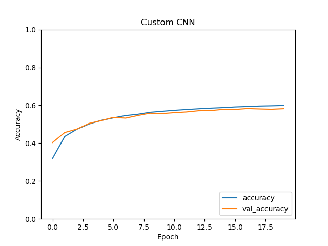
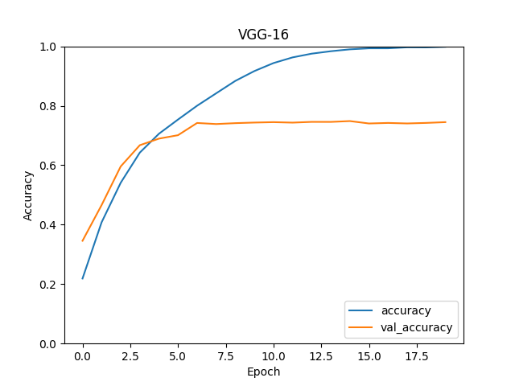
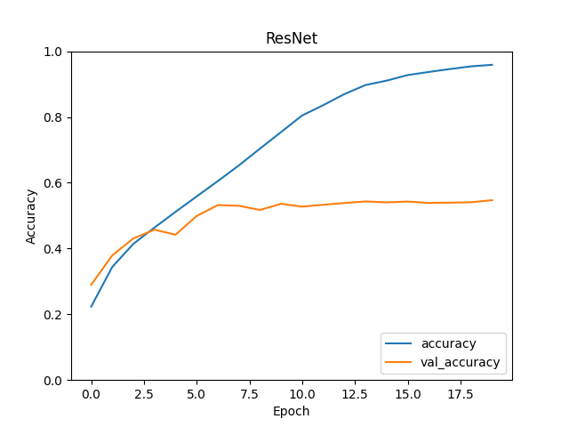

# CNN model comparison

## Dataset

- [CIFAR-10](https://www.cs.toronto.edu/~kriz/cifar.html)

## Preprocessing

- Train: `50000`
- Test: `10000`

## Models

- Custom CNN
- VGG16
- ResNet50

## Results

- Epochs: `20`
- lr: `1e-4`
- Loss: `categorical_crossentropy`
- Optimizer: `Adam`
- Scheduler: `ExponentialDecay`
- batch_size: `32`

<table>
    <tr>
        <th>Model</th>
        <th>Test Accuracy</th>
        <th>Graph</th>
    </tr>
    <tr>
        <td>Custom CNN</td>
        <td><code>0.5837</code></td>
        <td></td>
    </tr>
    <tr>
        <td>VGG16</td>
        <td><code>0.7378</code></td>
        <td></td>
    </tr>
    <tr>
        <td>ResNet50</td>
        <td><code>0.549</code></td>
        <td></td>
</table>
