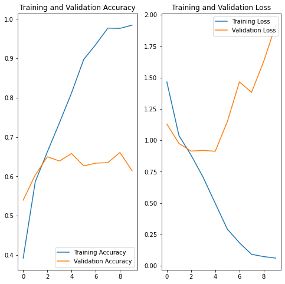
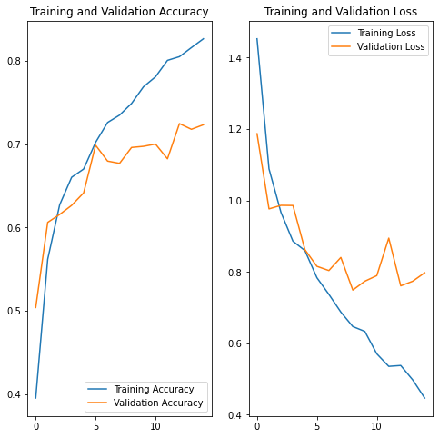

# Image classification

## Dataset

- [Flower_photos](https://www.tensorflow.org/datasets/catalog/tf_flowers)

## Preprocessing

- Train: `2939`
- Test: `735`

## Models

- Custom CNN

## Results

<table>
    <tr>
        <th>
            Model
        </th>
        <th>
            Graph
        </th>
    </tr>
    <tr>
        <td>
            Without Data Augmentation (NDA)
        </td>
        <td>
            
        </td>
    </tr>
    <tr>
        <td>
            With Data Augmentation (DA) and dropout
        </td>
        <td>
            
        </td>
    </tr>
</table>