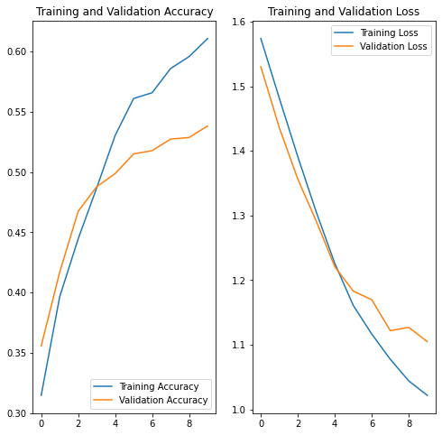
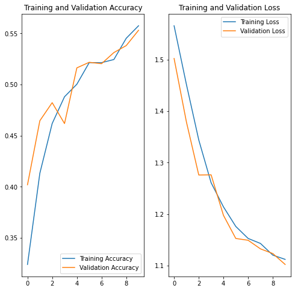

# Image classification

## Dataset

- [Flower_photos](https://www.tensorflow.org/datasets/catalog/tf_flowers)

## Preprocessing

- Train: `2939`
- Test: `735`
- baseline learning rate: `0.00001`

## Models

- Custom CNN
- VGG16

## Results

### default learning rate: `0.001`

<table>
    <tr>
        <th>
            Model
        </th>
        <th>
            Graph
        </th>
    </tr>
    <tr>
        <td>
            Custom CNN   Without Data Augmentation (NDA)
        </td>
        <td>
            
        </td>
    </tr>
    <tr>
        <td>
            Custom CNN   With Data Augmentation (DA) and dropout
        </td>
        <td>
            
        </td>
    </tr>
</table>

Final accuracy: `99.21%`

The model without data augmentation is overfitting. The model with data augmentation and dropout is not overfitting.

### learning rate: `0.00001`

<table>
    <tr>
        <th>
            Model
        </th>
        <th>
            Graph
        </th>
    </tr>
    <tr>
        <td>
            Custom CNN   Without Data Augmentation (NDA)
        </td>
        <td>
            
        </td>
    </tr>
    <tr>
        <td>
            Custom CNN   With Data Augmentation (DA) and dropout
        </td>
        <td>
            
        </td>
    </tr>
    <tr>
        <td>
            VGG16   Without Data Augmentation (NDA)
        </td>
        <td>
            
    </td>
</table>

Final accuracy: `43.49%`

As you can see, the accuracy is very low. This is because the learning rate is too low. The model is not learning anything.